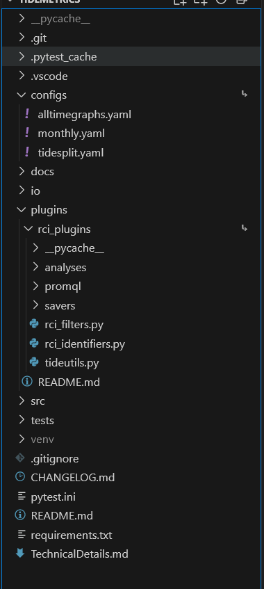

# RCI Metrics - Tide Metrics Automation

This repository is for SDSU's Reasearch and Cyber Infrastructure department's metrics plugins for use with [AutoMetrics](https://github.com/east-01/AutoMetrics).

## Installation

The installation instructions assume that you have:
- [AutoMetrics](https://github.com/east-01/AutoMetrics) installed and running.
- Python 3.12.6 or later

At the end of these instructions, your project structure should look like:



### For use only (not development)

If you don't want to write code for RCI metrics, only running it, all you have to do is:

1. Download a copy of this repositories' .zip
1. Place rci_plugins into AutoMetric's plugins folder
1. Place configs in a convenient location (I put mine in the AutoMetrics folder)

### For development

To develop the RCI metrics the installation is slightly more involved and based off of your
operating system. Essentially, you'll be making symlinks instead of moving the files like above.

1. Clone this repository with `git clone`
1. Make a symlink located in AutoMetrics/plugins/rci_plugins pointing to rci_plugins in the cloned 
repo.
1. Make a symlink for your configs file placed wherever you want to call it from in the command.

## Usage

See usage for [AutoMetrics](https://github.com/east-01/AutoMetrics) for commands. Documentation
below describes details specific to this plugin, like the analysis list and configuration options.

## Analyses

RCI Analyses are mainly focused on compute hours and job counts. The analyses are split up between 
multiple files, see each analysis organized by section below.

### Compute hours

Option | Analysis type | Description type |
-------|---------------|------------------| 
cpuhours | SimpleAnalysis | The amount of CPU hours consumed by each namespace.
cpuhourstotal | SimpleAnalysis | The total amount of CPU hours consumed by all namespaces.
cpuhoursavailable | AvailHoursAnalysis | The amount of CPU core hours available during time period.
verifycpuhours | VerificationAnalysis | Verifying the total cpu hours is less than the cpu hours available.
viscpuhours | VisualAnalysis | Bar graph visualizing cpu hours by namespace.
cpuhoursmeta | MetaAnalysis | Meta analysis showing total cpu hours over time.
viscpuhoursmeta | VisualAnalysis | Time series graph visualizing total cpu hours over time.
gpuhours | SimpleAnalysis | The amount of GPU hours consumed by each namespace.
gpuhourstotal | SimpleAnalysis | The total amount of GPU hours consumed by all namespaces.
gpuhoursavailable | AvailHoursAnalysis | The total amount of GPU hours available during time period.
verifygpuhours | VerificationAnalysis | Verifying the total gpu hours is less than the gpu hours available.
visgpuhours | VisualAnalysis | Bar graph visualizing gpu hours by namespace.
gpuhoursmeta | MetaAnalysis | Meta analysis showing total gpu hours over time.
visgpuhoursmeta | VisualAnalysis | Time series graph visualizing total gpu hours over time.
cvgpuhours | MetaAnalysis | The total amount of cpu and gpu hours compared across all periods.
visgpuhoursmeta | VisualAnalysis | Time series graph visualizing total cpu vs. gpu hours over time.

### Jobs

Option | Analysis type | Description type |
-------|---------------|------------------| 
cpujobs | SimpleAnalysis | The amount of unique *cpu only* jobs for each namespace.
cpujobstotal | SimpleAnalysis | The total amount of cpu jobs between all namespaces.
viscpujobs | VisualAnalysis | Bar graph visualizing cpu jobs by namespace.
gpujobs | SimpleAnalysis | The amount of unique jobs for each namespace.
gpujobstotal | SimpleAnalysis | The total amount of gpu jobs between all namespaces.
visgpujobs | VisualAnalysis | Bar graph visualizing gpu jobs by namespace.
jobstotal | SimpleAnalysis | The total amount of cpu and gpu jobs between all namespaces.
cvgpujobs | MetaAnalysis | The total amount of cpu and gpu jobs compared across all periods.
viscvgpujobs | VisualAnalysis | Time series graph visualizing total cpu vs. gpu jobs over time.

### Misc

Option | Analysis type | Description type |
-------|---------------|------------------| 
uniquens | SimpleAnalysis | Get all of the unique namespaces in the loaded Grafana DataFrames.
utilization | MetaAnalysis | A comparison of resource hours used vs available across all periods.
summary | SummaryAnalysis | The highest level analysis for monthly config, returns summary of data.
tidesplit | TideSplitAnalysis | The highest level analysis for tidesplit config, returns tidesplit metrics summary _per period_.
tidesplitmeta | AggregateAnalysis | Meta analyze tidesplit analyses over all periods, returns a single DataFrame with all periods' tide split data.

## Configuration

See base configuration details in [AutoMetrics](https://github.com/east-01/AutoMetrics),
documentation below describes configuration for these plugins.

### PromQL Ingest Controller

The PromQL ingest controller has two main points of configuration: the actual controller's config and then the ingest configs. The controller's configuration is responsible for which ingest configs will be run and over which periods. The ingest configs are responsible for a specific PromQL query, step value, and base url location. This split between configurations is in place so you can pull data from multiple PromQL sources at the same time.

#### Configuring the controller

**main-periods** Run the ingest on the main-periods specified in the timeline, if true there will be less overall queries but they will be larger. If false there will be more queries but they will be smaller- use this option if each query intakes a lot of data.</br>
**query-cfgs** This is the list of query config names that the ingest controller will use. The query config named `config.yaml` should be located at: `<AutoMetrics>/plugins/rci_plugins/promql/ingest_configs/config.yaml`. It will be referenced in the config like:

```
PromQLIngestController:
  main-periods: true
  query-cfgs:
    - config
```

#### Ingest configs

Each ingest config will have the following:

**base_url** The url endpoint that PromQL queries will go to via a GET request.</br>
**step** The period *in seconds* for each PromQL query.</br>
**query** The query string that will be used for the PromQL request. **Must contain** the keyword `%TYPE_STRING%` where you want your resource type to go.

### Available Hours Analysis Driver

The available hours analysis driver will find the amount of compute hours for the resource amounts as specified by the config. Each section should have rci-tide-cpu, rci-tide-gpu, and rci-nrp-gpu- with each section having subsections cpu, gpu, and node_cnt. 

Here is an example config with a single `default` section, for more nuanced use cases you can have multiple sections specifying different resource amounts.

```
AvailableHoursDriver:
  # Information about hardware configurations for each node.
  default:
    rci-tide-cpu:
      cpu: 64
      gpu: 4
      node_cnt: 6
    rci-tide-gpu:  # Targets L40 GPUs
      cpu: 24
      gpu: 4
      node_cnt: 17
    rci-nrp-gpu:  # Targets A100 GPUs
      cpu: 64
      gpu: 4
      node_cnt: 8
```

### Summary Driver

The summary driver is the final result of the montly.yaml configuration. It aggregates all data to directly place into the metrics report google sheet.

There is a single optional configuration point:

**top5hours_blacklist**: This is a list of namespaces that should be BLOCKED from making it into the top 5 list of highest compute hours.

### Tide Split Driver

The tide split driver is the final result of the tidesplit.yaml configuration. It aggregates all tide split data to directly place into the tide split report google sheet.